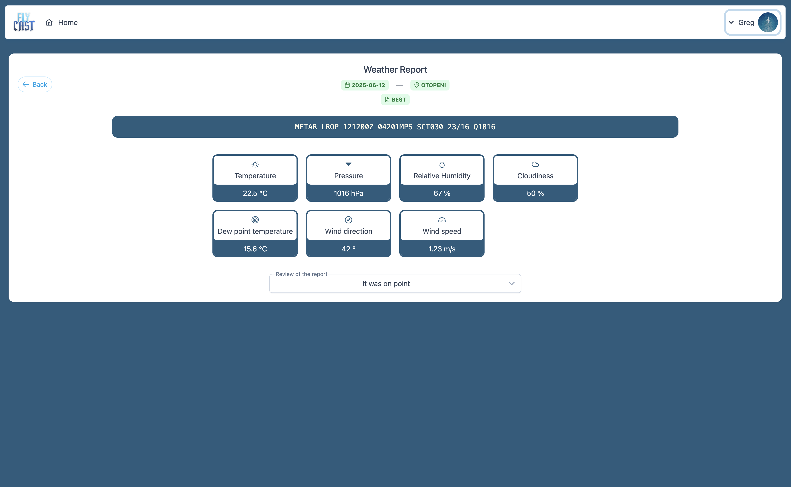

# Flycast 

----

## Objective
Offering pilots an easy solution for finding out weather conditions for the next day, 
an important step before departure.

## Solution

This application provides next-day meteorological forecasts — such as temperature, humidity, atmospheric 
pressure and others — delivered in both intuitive visual dashboards and standard METAR text format. 

Weather prediction is powered by a Python-based machine learning module. A Java Spring Boot backend orchestrates 
prediction requests, manages business logic, and integrates with a PostgreSQL database for storing historical 
weather and forecast data. The Angular frontend, styled with TailwindCSS and PrimeNG components, offers a 
responsive and user-friendly interface for viewing weather insights. Together, the system delivers accurate 
forecasts, clean visualizations, and aviation-ready METAR reports.

## Images

